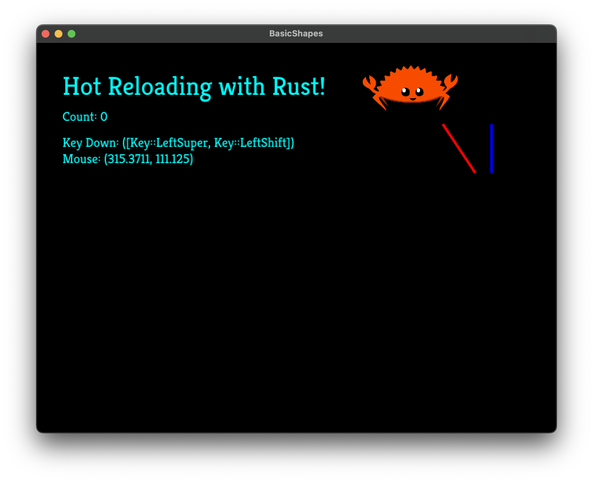

# Game Hotreload Example

This repository is an example project using the power of [Web Assembly](https://developer.mozilla.org/en-US/docs/WebAssembly) and the [WebAssembly Component Model](https://component-model.bytecodealliance.org/) to create a hot reloadable game development experience.

## Screenshot
